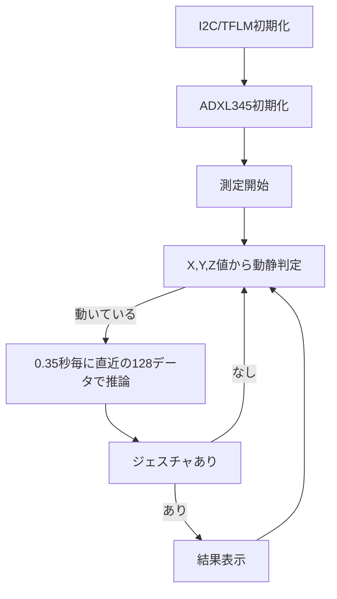

# # TensorFlow Lite for Microcontrollers と XIAO ESP32C6 と 加速度センサーでジェスチャ推論

## 仕様

ツール：VSCode, Platform builder, Arduino Framewark
使用ライブラリ：TensorFlow Lite for Microcontrollers　 (以降、TFLM)

[注]
ASISです。
テスト抜け、条件抜け、ご指摘、いろいろあると思いますがご容赦ください。
動作環境など多様な条件に対し動作保証をするものではありません。

対象デバイス：  

- CPU：XIAO esp32C6
- センサ：ADXL345

接続：  
VCC(3.3v)、GND、SDA、SDL端子をお互いに接続し、センサのSDO端とGNDとを接続。

## 大まかなフローチャート

  

## モデル

W, O, SLOPEを推論する、Magic wandモデル相当を自作したもの。

## その他

NOTE記載  

https://note.com/yuzu_monaka_/n/n46d1d95edd93
https://note.com/yuzu_monaka_/n/n177b50a7eeeb
https://note.com/yuzu_monaka_/n/n933c956eb8d6
https://note.com/yuzu_monaka_/n/n0d95ced05db9
https://note.com/yuzu_monaka_/n/nc0e71a38b6b2
https://note.com/yuzu_monaka_/n/n3c2430b5281f

