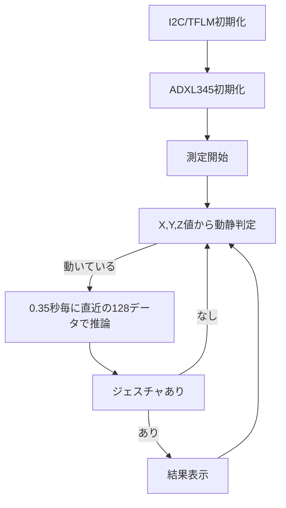

# TensorFlow Lite for Microcontrollers XIAO ESP32C と 加速度センサーで動きを検知

## 仕様

ツール：VSCode  
使用ライブラリ：TensorFlow Lite for Microcontrollers　 (以降、TFLM)

対象デバイス：  

- CPU：XIAO esp32C6
- センサ：ADXL345

接続：  
VCC(3.3v)、GND、SDA、SDL端子をお互いに接続し、センサのSDO端とGNDとを接続。

## 大まかなフローチャート

  

## モデル
W, O, SLOPEを推論する、Wind_Magicモデル相当を自作したもの。

## その他

NOTE記載  

<https://note.com/yuzu_monaka_/n/n0ed9b26451bb>

<https://note.com/yuzu_monaka_/n/n42976252831a>

<https://note.com/yuzu_monaka_/n/n8208c410c1d1>

<https://note.com/yuzu_monaka_/n/n4d729d129264>
